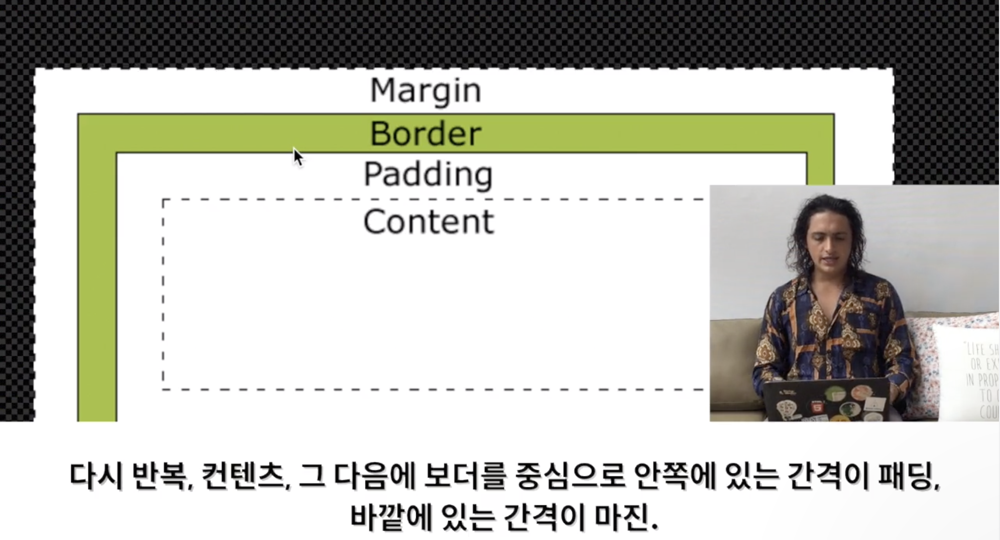

# CSS

css는 두가지 파트로 나뉘어져있음.

1. property part  -> ex) property-name: value;  무조건 소문자, 중간에 공백 없음, value 마지막에 세미콜론을 꼭 써야함. 안쓰면 오류남.

2. selector part  -> ex) selector (id, class, tag name) {
                              property-name: value;
                        }                             괄호를 열고 그 안에 수많은 property를 넣을 수 있음.

---
css와 html을 연결하는 방법

`<link href="styles.css" rel="stylesheet">`을 사용하면됨.

---
css의 elements들은 모두 박스임.

